<div align="center">

# MailFlare

**跑在 Cloudflare 上的自建邮箱，外加日历、通讯录与网盘。**

[](./LICENSE)
[](https://nodejs.org)
[](https://pnpm.io)
[](https://workers.cloudflare.com)
[](https://www.typescriptlang.org)

个人或小团队把邮件放在自己的域名上：Workers 收发，Postgres 存元数据，R2 存原文与附件。前端是可安装的 PWA。

[功能](#功能) · [截图](#截图) · [架构](#架构) · [快速开始](#快速开始) · [部署](#部署)

</div>

<p align="center">
  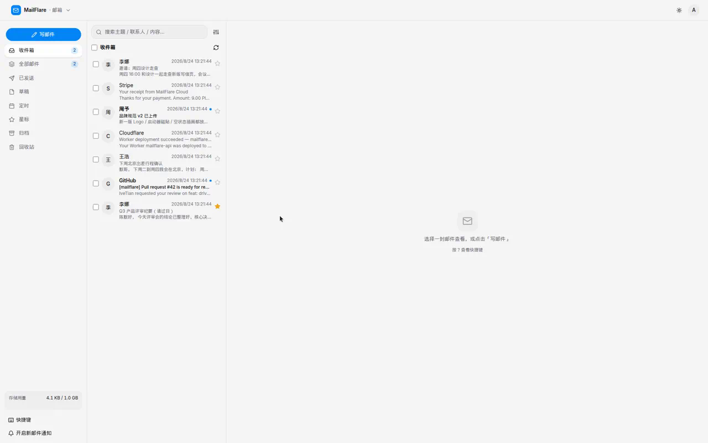
</p>

<p align="center">
  <sub>收件箱 · 会话线程 · Gmail 风格快捷键 · 深色模式</sub>
</p>

---

## 功能

| 应用 | 能力 |
| --- | --- |
| **邮箱** | 文件夹（收件箱 / 已发 / 草稿 / 定时 / 星标 / 归档 / 回收站）、搜索与分页、会话线程、回复 / 转发带引用、富文本写信、附件、草稿自动保存、`.eml` 原文、批量操作、Gmail 键位、ICS 邀请 RSVP、实时推送与桌面通知、PWA 离线读信 |
| **日历** | 日 / 周 / 月视图、重复规则、参与者、邮件邀请、提醒 |
| **通讯录** | 组织目录（部门 / 职务）+ 个人通讯录，写信自动补全 |
| **网盘** | 个人空间、文件夹、上传下载、分享链接、部门 / 权限组授权、回收站与配额 |
| **管理后台** | 仪表盘与按域用量、域名 DNS 校验（MX / SPF / DKIM / DMARC）、用户与配额、mailbox / 别名 / catch-all、公共邮箱、OIDC 应用与启动器磁贴、审计日志、模拟收信 |
| **身份** | MailFlare 可作为 OIDC IdP（授权码 + PKCE、RS256）。第三方「用 MailFlare 登录」，首页可挂 SSO 磁贴 |

其它：跨子域会话 cookie、发信日配额 + Cron、容量计量、品牌（站点名 / Logo）、移动端底部导航。

## 截图

<p align="center">
  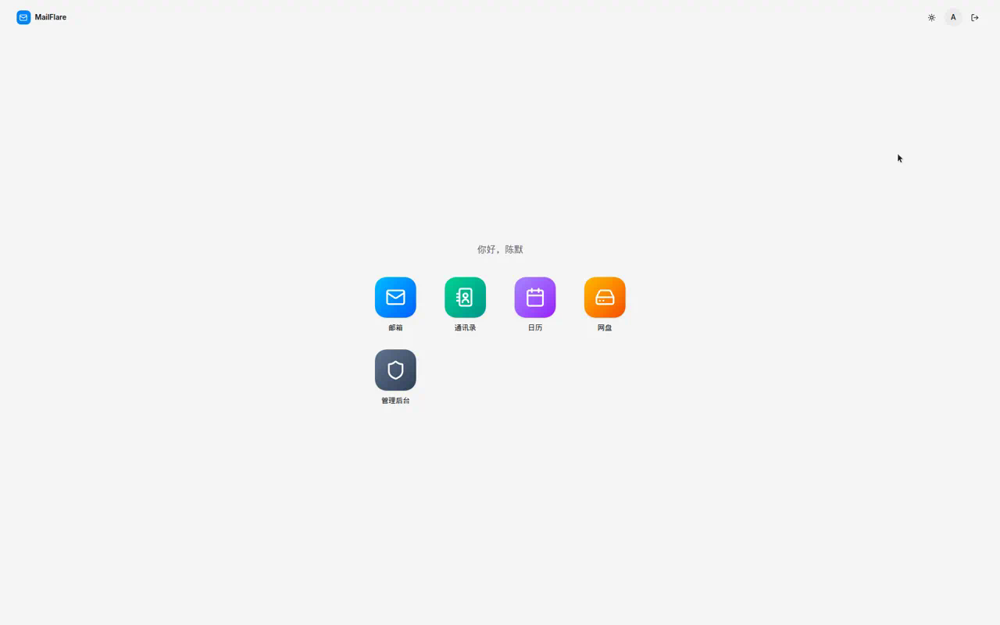
  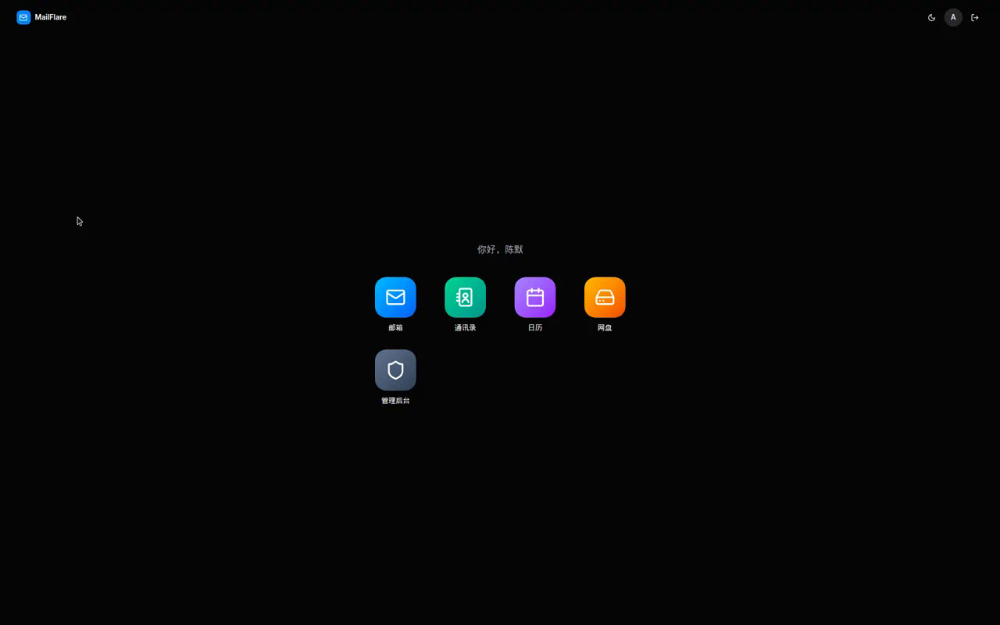
</p>

<p align="center">
  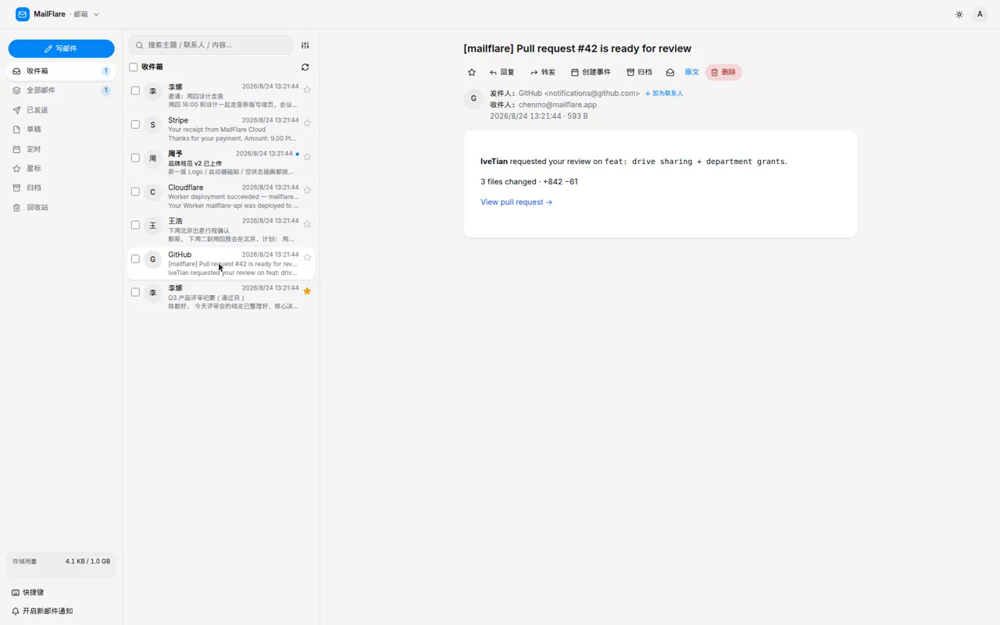
  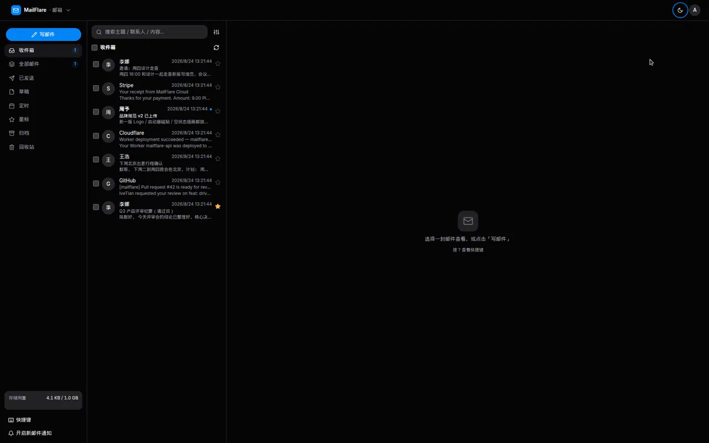
</p>

<p align="center">
  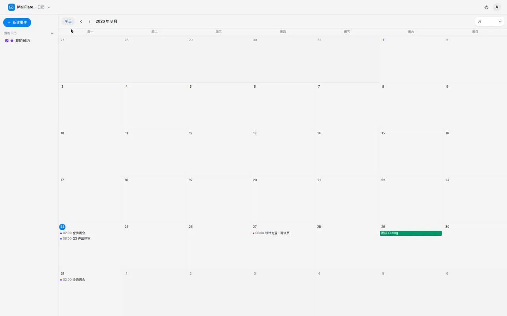
  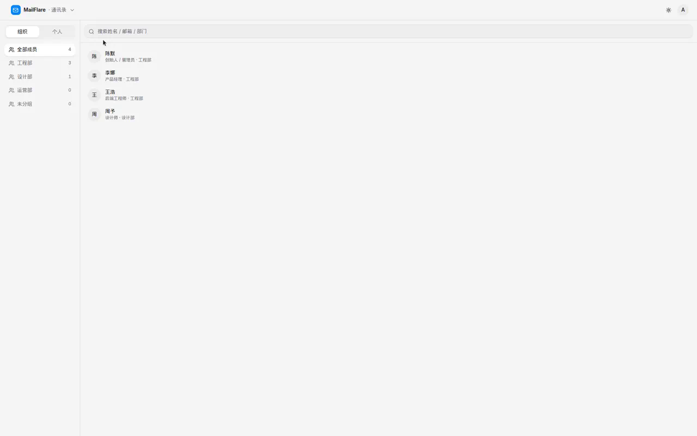
</p>

<p align="center">
  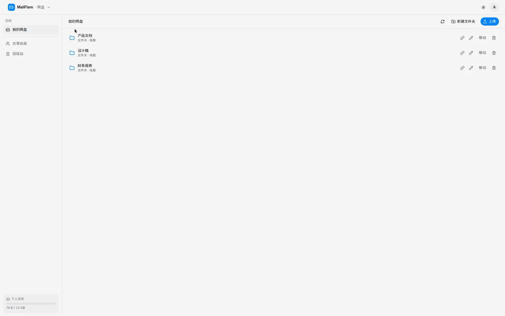
  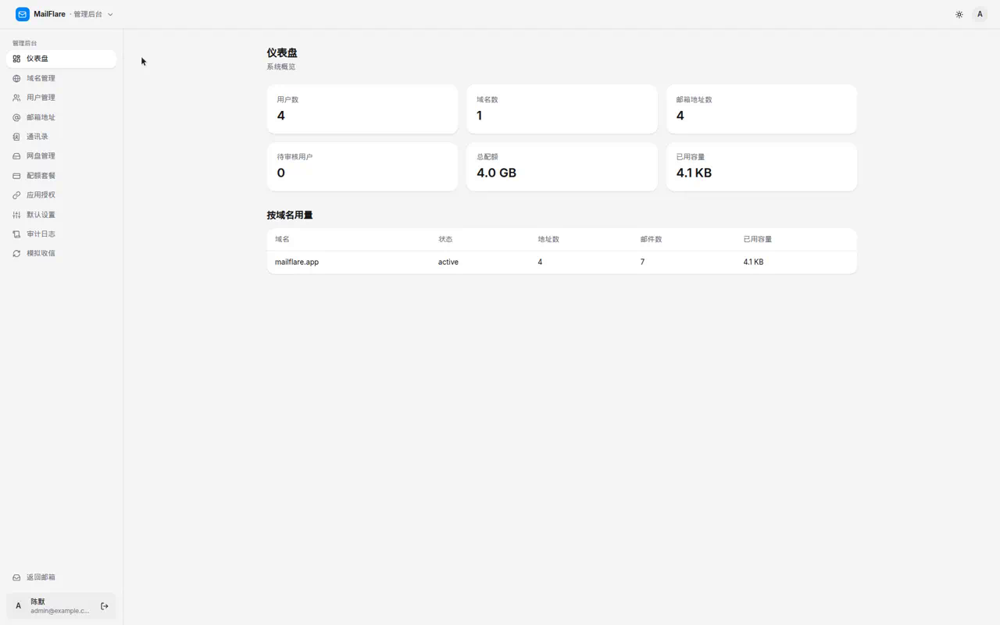
</p>

<p align="center">
  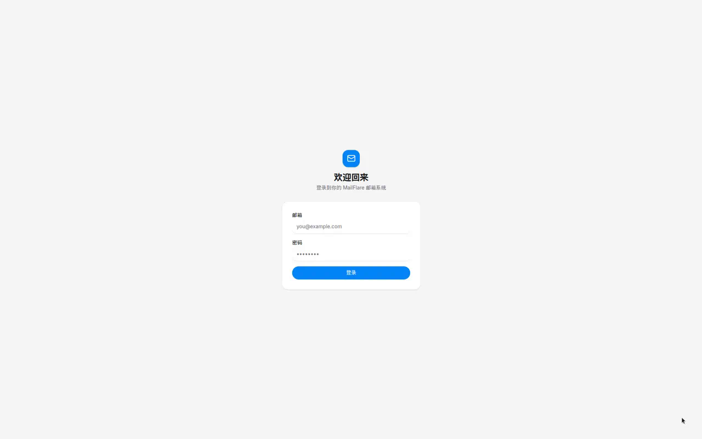
</p>

## 架构

前后端分离的两个 Worker，数据在外部 Postgres，大对象进 R2。

```
apps/web        React 19 + HeroUI V3 + Tailwind v4（Vite SPA）→ Static Assets Worker
apps/api        Hono + Better Auth + email() / scheduled() / Durable Object
packages/db     Drizzle schema · node-postgres · 迁移 · 种子
packages/auth   Better Auth 工厂（admin 插件 / 跨子域 cookie / 配额钩子 / OIDC）
packages/shared Zod schema · 跨端类型 · 枚举常量（唯一真源）
```

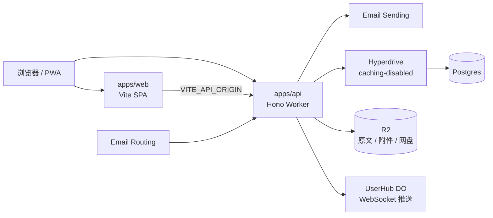

生产建议 `app.example.com` + `api.example.com`，cookie `Domain=.example.com`、`SameSite=Lax`。

## 技术栈

| 层 | 选型 |
| --- | --- |
| 前端 | React 19 · React Router 7 · HeroUI V3（CSS-first）· Tailwind v4 · TipTap · Vite 8 · PWA |
| 后端 | Hono 4 · Better Auth 1.6 · Zod · postal-mime · ical.js |
| 数据 | Drizzle ORM 0.45 · Postgres（经 Hyperdrive）· R2 |
| 运行时 | Cloudflare Workers · Durable Objects · Cron Triggers · Email Routing / Sending |
| 工程 | pnpm workspaces · Turborepo · TypeScript 5.7 · Wrangler 4 |

## 需要准备

1. **Cloudflare 账号**，并 `wrangler login`。一个托管在 Cloudflare 的**根域名**（`app.` / `api.` 子域，以及后续邮件 MX）。
2. **外部 Postgres**（[PlanetScale](https://planetscale.com) / [Neon](https://neon.tech) 等），使用**直连串**（不要 pooler、不要 Hyperdrive 串）。
3. **Node.js ≥ 24** 与 **pnpm 10**（`packageManager` 已锁在仓库里）。

## 快速开始

```bash
pnpm install

# R2 + Hyperdrive（把输出的 id 填回 apps/api/wrangler.jsonc）
wrangler r2 bucket create mailflare-raw-emails
# 必须 --caching-disabled：auth 场景下默认 SELECT 缓存会让「注册后立刻登录」读到空结果
wrangler hyperdrive create mailflare-hd --caching-disabled \
  --connection-string="postgres://<user>:<pw>@<host>/<db>?sslmode=require"

# 数据库（直连串，不是 Hyperdrive）
cp packages/db/.env.example packages/db/.env   # 填 DATABASE_URL
pnpm db:migrate
pnpm db:seed

# api 密钥
cp apps/api/.dev.vars.example apps/api/.dev.vars
# 填 BETTER_AUTH_SECRET（openssl rand -base64 32）
# 以及 WEB_ORIGIN / API_ORIGIN；本地 COOKIE_DOMAIN 留空

# web
cp apps/web/.env.example apps/web/.env.local   # VITE_API_ORIGIN=http://localhost:8787
```

本地起 api 时，Wrangler 从**进程环境变量**读 Hyperdrive 直连串，`.dev.vars` 不够：

```bash
export CLOUDFLARE_HYPERDRIVE_LOCAL_CONNECTION_STRING_HYPERDRIVE="postgres://..."
pnpm --filter @mailflare/api dev    # http://localhost:8787
pnpm --filter @mailflare/web dev    # http://localhost:5173
# 或：pnpm dev
```

打开 [http://localhost:5173/register](http://localhost:5173/register)。系统**零用户**时，第一位注册者自动成为管理员并进入域名配置向导；之后账号由管理员在后台创建。

| 检查 | 期望 |
| --- | --- |
| `curl http://localhost:8787/api/health` | `{"ok":true}`（内部 `select 1`） |
| 打开 5173 | 登录页有样式；右上角可切换深 / 浅色 |
| `GET /api/auth/get-session` | 登录后 cookie 带回当前用户 |
| 非管理员访问 `/api/admin/*` | 403 |

## 部署

同根域两个子域：`app.example.com` / `api.example.com`。

```bash
# apps/api/wrangler.jsonc → vars：WEB_ORIGIN / API_ORIGIN / COOKIE_DOMAIN=.example.com
cd apps/api && wrangler secret put BETTER_AUTH_SECRET
pnpm --filter @mailflare/api deploy

# apps/web/.env.local → VITE_API_ORIGIN=https://api.example.com
pnpm --filter @mailflare/web deploy
```

两个 Worker 各自绑自定义域。生产迁移用直连串跑 `pnpm db:migrate`（不要走 Hyperdrive）。真实收信还需要 Email Routing + MX / SPF（管理后台可一键校验）；出站走 Email Sending。

## 项目结构

```
mailflare/
├── apps/
│   ├── api/          # Hono Worker：fetch / email / scheduled / UserHub
│   └── web/          # Vite SPA + Static Assets Worker
├── packages/
│   ├── db/           # schema、迁移、seed
│   ├── auth/         # createAuth(db, env)
│   └── shared/       # Zod + 常量
├── docs/screenshots/ # README 截图
└── building_plan.md  # 分阶段实施记录
```

## 约定与坑

- **Hyperdrive 必须 `--caching-disabled`**。默认缓存约 60s，注册后立刻登录会报 `Invalid email or password`（账号其实已写进库）。已有配置：`wrangler hyperdrive update <id> --caching-disabled`。
- **Hyperdrive 只在 Worker 运行时可用**。drizzle-kit、Better Auth CLI、seed 一律用 `DATABASE_URL` 直连串。
- **Better Auth 只拥有** `user` / `session` / `account` / `verification`（以及 OIDC / JWKS 相关表）。业务表自管，经 `userId` 外键关联。认证表手写于 `packages/db/src/schema/auth.ts`；改认证配置后跑 `pnpm auth:generate`。
- 源码 import 带 `.js` 扩展名（`verbatimModuleSyntax` + Bundler）。枚举从 `@mailflare/shared` 引，不要在多处重定义。
- 密钥进 `.dev.vars` / `wrangler secret`，不要写进 `wrangler.jsonc` 或提交。

## 命令

| 命令 | 作用 |
| --- | --- |
| `pnpm dev` | 并行起 web + api |
| `pnpm typecheck` | 全仓 `tsc --noEmit` |
| `pnpm build` | web：Vite；api：wrangler dry-run |
| `pnpm db:generate` / `db:migrate` / `db:seed` | 生成迁移 / 应用 / 种子 |
| `pnpm cf-typegen` | 改 `wrangler.jsonc` 后重生 Env 类型 |
| `pnpm auth:generate` | 改认证配置后重生 auth schema |
| `pnpm deploy` | 各包 `wrangler deploy` |

没有测试框架；`lint` 是空 echo。改完代码默认跑 `pnpm typecheck`。

## 路线图

完整记录见 [`building_plan.md`](./building_plan.md)。

- [x] 地基 + 管理后台
- [x] 邮件收发核心（入站 `email()` + 出站 Sending + R2）
- [x] Webmail（线程、文件夹、草稿、附件、配额）
- [x] 别名 / catch-all、DNS 校验、发信日配额、审计、用量
- [x] 归档、批量、快捷键、移动端
- [x] 日历、通讯录、网盘、PWA / 离线、OIDC IdP

可选后续：域名 onboarding 自动化、退信 / 抑制名单、IMAP / SMTP 网关、垃圾过滤、标签 / Snooze。

## 贡献

Issue 和 PR 都欢迎。动手前请：

1. 用 Node ≥ 24 + pnpm 10 装依赖。
2. 改 schema 后 `pnpm db:generate && pnpm db:migrate`。
3. 提交前 `pnpm typecheck`（改了 Worker 绑定再加 `pnpm build`）。

更细的架构说明在 [`CLAUDE.md`](./CLAUDE.md)。

## 许可证

[MIT](./LICENSE)
